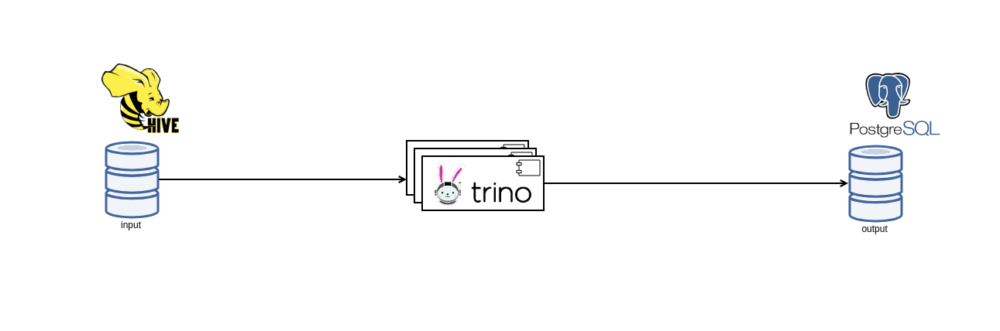

dbt-trino-hive-2-postgres
=========================

This proof of concept project is thought to showcase a rather uncommon use case for
[Trino](https://trino.io/) SQL query engine of copying data from one database into
another database.

Trino is known in the analytics world for its highly parallel and distributed
query engine which can pull data from a wide range of disparate data sources
and perform analysis without the need for complex, slow and error-prone processes
for copying the data.


This project does not show anything related on how to use Trino on performing OLAP
statements, but rather a more pragmatic ad-hoc use case of copying data from one place to another.

It is relatively common to have a situation where a table with up to a few millions of rows is found
on one database and we want its contents copied to another database for either development or migration
purposes.

In such cases, Trino may come to the rescue before twisting your head on how to copy the data from
one database to another.

This project showcases the scenario of copying the content of a [hive](https://hive.apache.org/) table
towards a [PostgreSQL](https://www.postgresql.org/) table.



Obviously, the input and output databases / object stores can be chosen in need by using any
of the available Trino [connectors](https://trino.io/docs/current/connector.html).


## Demo

The following demo is based on [docker](https://www.docker.com/) and can be easily
executed on any workstation without additional tools.

Spin up Docker environment for working with:
 
- Trino 
- [minio](https://min.io/) hive compatible  object storage
- PostgreSQL database


```
docker-compose up -d
```


### Create a bucket in MinIO


Open [MinIO UI](http://localhost:9000/) by using the following credentials:

- access key: `minio`
- secret key: `minio123`

Create the bucket `tiny`

### Trino CLI

Check out the available catalogs on Trino:

```
docker container exec -it trino-hive-2-postgres_trino-coordinator_1 trino
```

```
trino> show catalogs;
 Catalog  
----------
 minio    
 postgres 
 system   
(3 rows)
```


Create Trino `minio.tiny` schema

```
CREATE SCHEMA minio.tiny
WITH (location = 's3a://tiny/');
```

Create `minio.tiny.customer` hive table


```sql
CREATE TABLE minio.tiny.customer (                                                     
    first_name varchar(32),                        
    last_name varchar(32),                         
    email varchar(256),
    id bigint                             
 )                                                 
 WITH (                                            
    external_location = 's3a://tiny/customer', 
    format = 'ORC',
    partitioned_by= ARRAY['id']
 );
```

Populate `minio.tiny.customer` hive table

```
INSERT INTO minio.tiny.customer (id, first_name, last_name, email)
    VALUES 
        (1,'Michael','Perez','mperez0@chronoengine.com'),
        (2,'Shawn','Mccoy','smccoy1@reddit.com'),
        (3,'Kathleen','Payne','kpayne2@cargocollective.com');

```


Copy the content of the `minio.tiny.customer` hive table towards Postgres

```
CREATE TABLE  postgres.public.customer AS
SELECT id, first_name, last_name, email
FROM  minio.tiny.customer;
```


By performing the statement:

```
SELECT * FROM postgres.public.customer;
```

can be verified that the entries copied from hive exist in the newly created Postgres table.


This demo showcases also copying incremental changes `minio.tiny.customer` hive table towards Postgres.

Add new content to the Hive table:

```
INSERT INTO minio.tiny.customer (id, first_name, last_name, email)
    VALUES 
        (4,'Rosa','McDonald','rmcdonald@bit.com');
```


Copy incrementally new content from Hive into Postgres:

```
INSERT INTO postgres.public.customer
SELECT id, first_name, last_name, email
FROM minio.tiny.customer
WHERE id > (SELECT MAX(id) FROM postgres.public.customer);
```


Stop and tear down the docker environment used for the demo purposes:

```
docker-compose down
```


## Conclusions


As can be seen from the brief demo shown above, Trino can be also used
to copy data from one database/object store to another database/object store.

Obviously there are other ways to copy content from one database to another,
but in case you have familiarity to Trino, this may spare you some hours
in achieving an ad-hoc copy of the content of a table from an input database
towards another table in an output database.

The Trino session propperty `write_batch_size` available on the JDBC connectors 
(set by default to `1000`) can be used to speed up the insertion of the data to the output database.